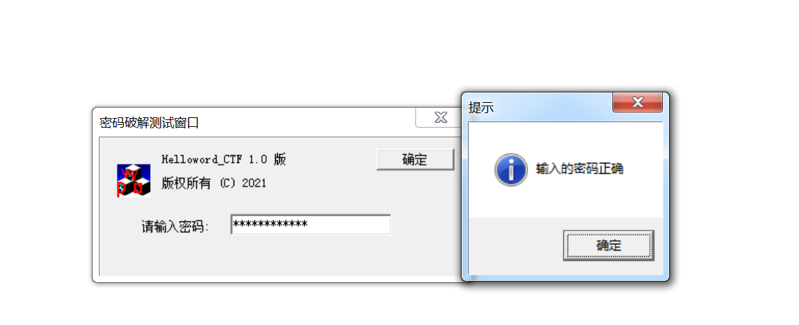

# 实验一 PE文件破解和插桩注入
## 1.自编helloworld程序，解释汇编代码，写上注释。
```
push ebp
mov ebp,esp
#这两行代码保存了当前的栈帧指针（ebp）并设置一个新的栈帧指针。
6A FF |push -0x1
#这一行将一个值 -0x1 推送到栈上。
68 38014200 |push demo.00420138
68 243E4000 |push demo.__except_handler3ldBlock?9?$DO>; SE 处理程序安装
#这两行将两个函数地址推送到栈上。第一个地址是 demo.00420138，第二个地址是 demo.__except_handler3ldBlo
64:A1 0000000|mov eax,dword ptr fs:[0]
#这一行将FS段寄存器的值（通常用于线程局部存储）的偏移为0的地址处的值加载到eax寄存器中。
50 |push eax; kernel32.BaseThreadInitThunk
64:8925 00000|mov dword ptr fs:[0],esp
#这两行代码保存了当前的线程环境，包括堆栈指针，以备后续的异常处理。
83C4 F0 |add esp,-0x10
#这一行减小了栈指针，为局部变量分配了16个字节的空间。
53 |push ebx
56 |push esi
57 |push edi
#这三行将寄存器ebx、esi和edi的值推送到堆栈上，以保存这些寄存器的值。
8965 E8 |mov [local.6],esp
#这一行将当前堆栈指针的值保存到局部变量local.6中。
FF15 3C514200|call dword ptr ds:[<&KERNEL32.GetVersion>]; kernel32.GetVersion
#这一行调用了kernel32.GetVersion函数
A3 E4354200 |mov dword ptr ds:[_osvermSetgerLister],eax; kernel32.BaseThreadInitThunk
A1 E4354200 |mov eax,dword ptr ds:[_osvermSetgerLister]
C1E8 08 |shr eax,0x8
25 FF000000 |and eax,0xFF
A3 F0354200 |mov dword ptr ds:[_winminorabCounter_Installed],eax; kernel32.BaseThreadInitThunk
#这些指令用于获取操作系统的主版本号和次版本号，并保存到相关的全局变量中
8B0D E4354200|mov ecx,dword ptr ds:[_osvermSetgerLister]
81E1 FF000000|and ecx,0xFF
890D EC354200|mov dword ptr ds:[_winmajorlocrpDefer],ecx
8B15 EC354200|mov edx,dword ptr ds:[_winmajorlocrpDefer]
C1E2 08 |shl edx,0x8
0315 F0354200|add edx,dword ptr ds:[_winminorabCounter_Installed]
8915 E8354200|mov dword ptr ds:[_winverwnVece],edx ; demo.<ModuleEntryPoint>
#这些指令用于获取操作系统的次次版本号和构建号，并保存到相关的全局变量中。
A1 E4354200 |mov eax,dword ptr ds:[_osvermSetgerLister]
C1E8 10 |shr eax,0x10
25 FFFF0000 |and eax,0xFFFF
A3 E4354200 |mov dword ptr ds:[_osvermSetgerLister],eax
#这些指令用于获取操作系统的构建号，并保存到相关的全局变量中。
6A 00 |push 0x0
E8 9D2A0000 |call demo._heap_initgClientooksSinceed
#这两行代码用于初始化堆内存管理，并调用demo._heap_initgClientooksSinceed函数。
83C4 04 |add esp,0x4
85C0 |test eax,eax; kernel32.BaseThreadInitThunk
#这两行用于检查堆内存管理的初始化是否成功。它们对eax寄存器中的值进行测试，以查看是否为零。
75 0A |jnz short demo.004011B4
6A 1C |push 0x1C
E8 CF000000 |call demo.fast_error_exitoldstdstalled
83C4 04 |add esp,0x4
#如果初始化失败（test指令的结果非零），则跳转到demo.004011B4，否则继续执行。在这种情况下，它将调用demo.
C745 FC 00000|mov [local.1],0x0
#这一行将值0x0 存储到局部变量local.1 中。
E8 10270000 |call demo._ioiniterify_blockObjectsled
#这一行调用了demo._ioiniterify_blockObjectsled函数。
```
## 2.对Helloworld_CTF.exe进行逆向分析
#### （1）找密码
- 目标：找到Helloworld_CTF.exe程序的正确密码并验证
- 过程记录：
- `onlydebug`对文件进行分析，使用**中文搜索引擎**找到判断密码是否正确的位置：

- 在 IDA 中打开程序，再通过`搜索字符串`得到下表，判断 `thechosenone` 很可能是密码：

- 点击`thechosenone`字符串，可跳转到至下列详解图（IDA View），在空白处右键，操作后跳转至代码模,空白处右键后点击 `Graph view` 转换至图形模式（或直接空格跳转）,可得该程序的关系图：

- 可以分析得出，该程序就是通过比对输入的密码和该字符串是否一致来判断对错，所以`thechosenone`就是密码。

####  (2)改逻辑
- 目标：是`输入错误的密码`时，会弹出`密码正确`的弹窗，`输入正确的密码`时，反而会提示`密码错误`。
- `onlydebug`对文件进行分析，使用**中文搜索引擎**找到判断密码是否正确的位置,再找到判断密码是否正确的汇编代码的位置：


- 使用`010editor`打开文件，得到二进制形式的文件，通过 `ollyDebug`中对应的汇编代码在文件中存储位置（即最左侧一栏的十六进制地址），或者直接使用`ctrl F`搜索`7516`,将其改为 `7418`（记得先将文件属性里的只读模式取消）:


- 当输入正确密码时：

- 当输入错误密码时：

#### (3)改密码
- 通过`找密码`的过程，可以确认密码在文件中的存储位置:


- 改密码：

- 输入密码测试：

## 3.对我们共享的`Helloworld.exe`插入二进制或者汇编代码，弹出`messagebox`
- win10弹不出使用了老师的win7
- 对照着老师所给虚拟机中已经插桩完成的汇编语言进行修改的，首先找到跳转的位置：


`jmp Hellowor.5G451DA5`跳转到最后的位置
- 模仿上述代码，在可编写处插入编写了新的字符串以及执行汇编代码的位置，并且修改了一开始跳转的地址，指向了新的汇编代码所在的位置：


- 调试结果：

- 不知道为什么`cwy`前两个乱码成这样，换一下字之后没有这种情况