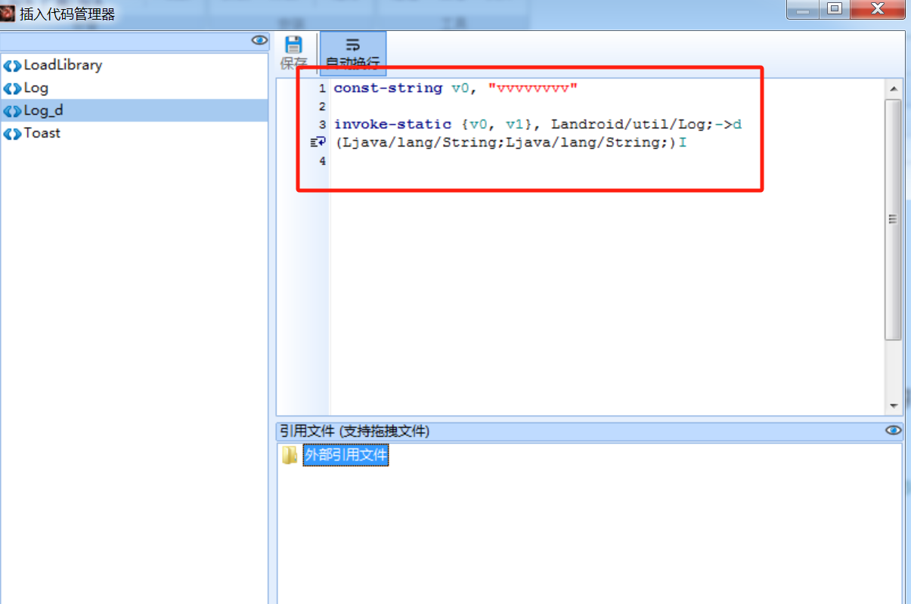
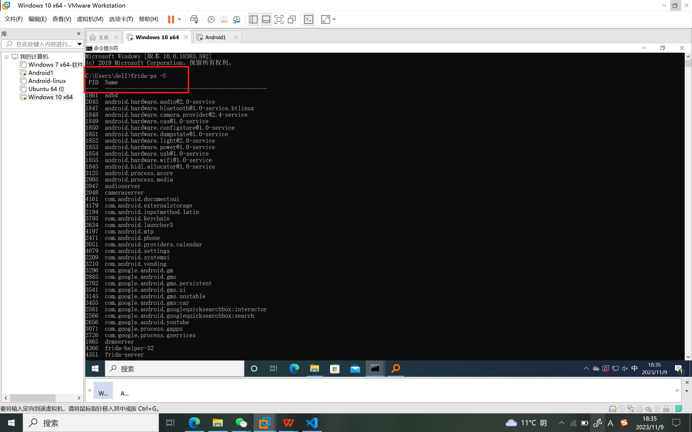
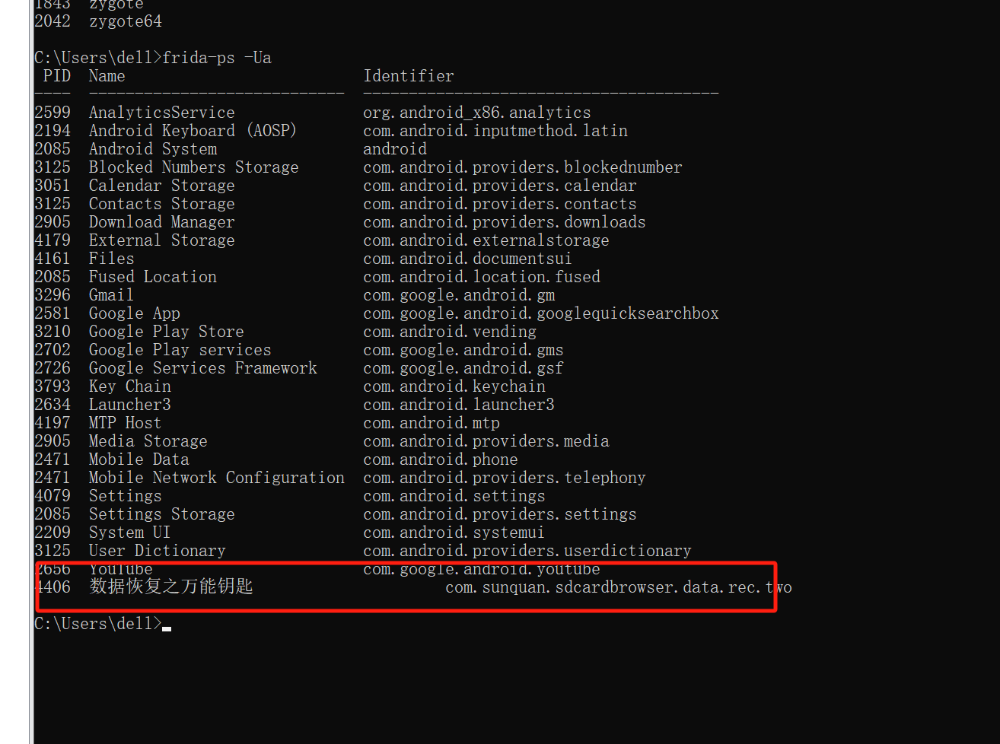

## 实验二 Android安全实践
### 实验环境
- VMware Workstation 17 Pro：17.0.0 build-20800274
- Android（虚拟机）
  - 网络设置：仅主机模式
  - ip地址：192.168.234.128
- win7（虚拟机）
  - 网络设置：仅主机模式
  - ip地址：192.168.234.130
### 实验问题
1. adb使用
包括Android虚拟环境配置、网络连接，以及adb安全实践实例：在目标Android系统中使用adb建立
新的通讯录记录，并读取为文本文件，最后传输到本地。
2. Android破解
采用动静态分析两种办法，破解给定的Android程序。
3. Android脱壳
给定的Android加壳程序，获取有效的dex文件。
### 实验内容
####  1、adb使用
**包括Android虚拟环境配置、网络连接，以及adb安全实践实例：在目标Android系统中使用adb建立新的通讯录记录，并读取为文本文件，最后传输到本地。**

- 编写vcf文件
```
# 编辑第一位联系人
BEGIN:VCARD
VERSION:3.0
N:Chen;Wenyan;;;;
TEL;TYPE=cell:15200000000
END:VCARD
# 编辑第二位联系人
BEGIN:VCARD
VERSION:3.0
N:Wei;Xiaoyu;;;
TEL;TYPE=cell:15200000001
END:VCARD
```
- 确定win7和Android已在同一片网络下，ping测试
`Android-ping-win7`

`Android-ping-win7`

- `win7`使用`adb`连接`Android`虚拟机，并查询是否成功连接
```
adb connect 192.168.234.128
adb devices
```

- 先清除原通讯录联系人
```
adb shell pm clear com.android.providers.contacts
```

- 将正确格式的通讯录文件`contacts.vcf`, 导入`android`模拟器中,从文件中, 将联系人`import`到`android`模拟器的通讯录中
```
adb push contacts.vcf /sdcard/contacts.vcf
adb  shell am start -t "text/x-vcard" -d "file:///sdcard/contacts.vcf" -a android.intent.action.VIEW com.android.contacts
```


- 将通讯录数据存储为txt格式文件
  - `adb shell ` 回车进入 adb shell 模式
  - `su ` 遇到权限问题
  - 先读取通讯录数据验证存储为txt文件`content query --uri content://contacts/phones > /data/file.txt`
  
  - `adb pull /data/file.txt`导出到win7
  

####  2、Android破解
**采用动静态分析两种办法，破解给定的Android程序。**
- 在`win7`虚拟机上使用`adb`连接`Android`虚拟机

- 配置`Androidkiller`的`java`路径

- 启动程序，通过随便输入一个用户名和密码，获得提示`无效用户名或注册码`

- 在Androidkiller中查找`无效用户名`其出现的位置

- 找到新的查找方向：元素名称`unsuccessed`,再通过查找该元素名称，找到其唯一标识`0x7f05000b`

- 通过该唯一标识找到其所在的`smail`文件，这段代码处理在`MainActivity`的内部类中的按钮点击事件，并根据处理结果更新`UI`。
- 查看`MainActivity.smail`文件

- 继续查看代码，找到函数`CheckSN`:里面有用户名`userName`和注册码`sn`(这里的sn被md5加密了，不可以直接打印使用)

- 用`SN`查找到了没有被加密的`userSN`

- 可以看到，这里已经插入了一个可以打印`debug`类型日志的代码

##### 方法一：在客户端直接查看日志(动态)
- 设置日志筛选类型为`debug`，在`Android`里点击注册（注册码必须输入为16位）
- 可以发现该日志打印出的`message`即为密码

- 测试结果：该程序已注册

##### 方法二：使用命令行查看日志(动态)
- 查看进程`adb shell dumpsys meminfo | find "crackme0201"`

- 查看日志`adb logcat --pid=5553`

- 测试成功：该程序已注册

##### 方法三 修改samil代码(静态)
**①**
- 函数`CheckSN`的功能是用来验证输入的注册码是否正确，若正确则返回1，错误则返回0。
- 修改代码逻辑，即直接跳过验证过程，返回1（使无论输入何种注册码均为正确）

- 依次点击`卸载` `编译` `安装` `运行`
- 成功！！！


**②**
- 或者修改`MainActivity$1.smali`文件
>代码说明：
当输入值正确时，寄存器中的值不为0时，跳转出注册成功（cond_0）的消息
因此只需要改逻辑，使得判断变为：
当输入值错误，寄存器中的值为0时（即 if-eqz v0）则跳转到cond_0标号处，即完成破解
- 将判断条件`if-nez v0`修改为`if-eqz v0`，即将跳转条件反了一下，保存文件

- 重新编译`APK`文件
```
apktool.bat b C:\Users\Administrator\Desktop\AndroidKiller_v1.3.1\projects\crackme02\Project
```

在`project`文件内会新生成的`dist`文件夹，内含新的`apk`文件

- 签名`apk`
将打包好的`project.apk`复制到与`auto-sign`工具同一文件夹下，执行命令：
```
java -jar signapk.jar testkey.x509.pem testkey.pk8 project.apk crackme_sign.apk
```

- 将新`apk`文件拉到安卓
```
adb push crackme_sign.apk /sdcard/download/
```

- 在安卓的文件中找到`crackme_sign.apk`下载下来
- 完成破解！！！！！！

####  3、Android脱壳
**给定的Android加壳程序，获取有效的dex文件。**
>环境
>- Android虚拟机：x86_64，Android8.0系统
> - win10虚拟机：x64
>- python：3.7.4
> - frida：12.8.0
- 安装`frida`库
[frida安装教程](https://www.cnblogs.com/tjp40922/p/12799139.html)下载`frida.egg`放在对应的文件夹下

```
# cd 到对应文件夹下后进行安装
easy_install frida-12.8.20-py3.7-win-amd64.egg
# 安装 frida-tools
pip install frida-tools==5.3.0 -i https://pypi.tuna.tsinghua.edu.cn/simple/
# 查看 frida 版本，确认是否成功安装
frida --version
# 安装 frida-dexdump
pip3 install frida-dexdump
# 通过查看 frida-dexdump 的帮助信息确认是否成功安装
frida-dexdump -h
```


- 查看Android模拟器的cpu架构
```
adb shell
getprop ro.product.cpu.abi
```

- 下载版本与环境适配的`frida-server`

- 把`frida-server`拉到`Android`虚拟机
```
adb push C:\Users\dell\Desktop\frida-server-12.8.0-android-x86_64 /data/local/tmp/frida-server
```

- 运行`frida-server`
```
adb shell
# 切换为 root 用户
su
# 修改权限为777
chmod 777 frida-server
# 在当前目录下运行 frida-server
./frida-server
```

- 检查是否运行成功(注意另开一个新的cmd)
```
# 列出所有正在运行的进程,包括系统进程和普通应用程序进程,也包括那些与用户界面无关的后台进程
frida-ps -U
```

- 运行成功！！！！！
- 进行脱壳
在`Android`虚拟机中打开`数据恢复之万能钥匙`，打开后在本机运行命令`frida-ps -Ua`列出所有用户级别的进程，
即普通应用程序进程

- 获得`dex`文件
```
frida-dexdump -U -f fishfly.guard
```

- 找到`dex`文件并打开


#### 4、参考链接
- [Android 逆向笔记 —— 一个简单 CrackMe 的逆向总结](https://cloud.tencent.com/developer/article/1870346)
- [一步一步带你反编译apk，并教你修改smali和重新打包](https://blog.csdn.net/sxk874890728/article/details/80486223)
- [frida](https://github.com/frida/frida/releases?expanded=true&page=4&q=12.8.0)
- [frida详细环境安装](https://blog.csdn.net/qq_41369057/article/details/131242586)
- [【移动安全基础篇】——23、IDA脱壳脚本编写](https://blog.csdn.net/Fly_hps/article/details/86161078)